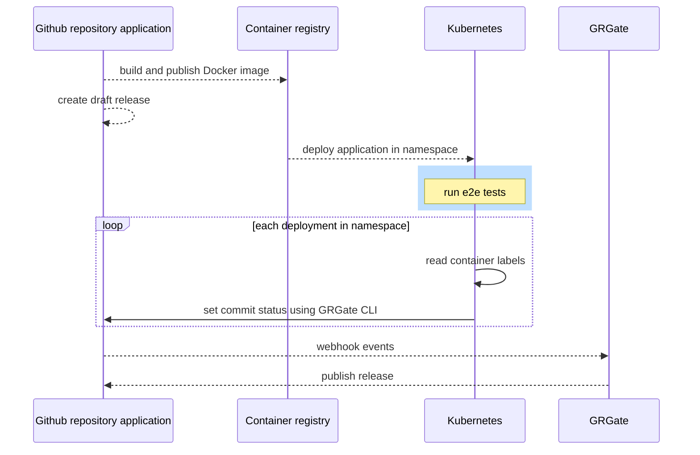

## Using GRGate with Docker labels and Kubernetes



Docker labels can be used to gather information about running container and
which repository and commit sha is attached to them. With this information,
it is possible to provide back the state of the end-to-end tests via commit
status. When all tests are successful, GRGate will automatically publish the
release.



The steps below describe how to do it for a single container:

1. build an app using Docker and attach metadata information to the image
2. create a draft release
3. image is pushed to a container registry which trigger a deployment of the
container to a specific environment
4. integration tests are run against the environment
5. when it succeeds, update the commit status attached from the repository
6. GRGate publish the release

In practice, let's say we have an app built with Docker, we embed the
repository and commit sha for reference later on:

```Dockerfile
FROM alpine

LABEL repository="my-organization/my-repository"
LABEL commitSha="abcd1234"
```

The repository would have a `.grgate.yaml` config located in the root of the
repository:

```yaml
statuses:
  - e2e happy flow
```

After the image is built some task could automatically generate a draft release
and after the app is deployed to an environment, a system can run integration
tests against the image and when the tests succeeded and based on the
previously defined labels, we can use the `grgate` cli to update the commit
statuses as follow:

```bash
repository=$(docker inspect my-app --format='{{.Config.Labels.repository}}')
commitSha=$(docker inspect my-app --format='{{.Config.Labels.commitSha}}')

grgate status set "$repository" \
  --commit "$commitSha" \
  --name "e2e happy flow" \
  --status completed \
  --state success
```

From there, if GRGate is listening to webhook, then the draft release will be
published.
